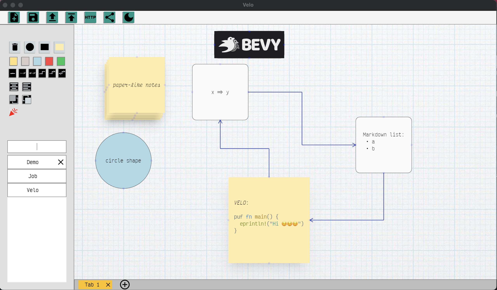

# Velo 🚵 
[](https://codecov.io/gh/StaffEngineer/velo)



## Demo

This app is primarily designed for native desktop platforms, and its
WebAssembly (wasm) target has a limited feature set. wasm target is best
suited for quick document sharing and editing, currently only landscape
mode is supported (tested on Chrome):

[<https://staffengineer.github.io/velo?document=https://gist.githubusercontent.com/StaffEngineer/a6139b3dc88775d3f181757d40f976e0/raw/470df8d8213c03afd11c5d8b4902a20154c34dc7/velo.json>](https://staffengineer.github.io/velo?document=https://gist.githubusercontent.com/StaffEngineer/a6139b3dc88775d3f181757d40f976e0/raw/470df8d8213c03afd11c5d8b4902a20154c34dc7/velo.json)

## Inspiration

At work, I frequently rely on lucid.app to brainstorm ideas with my
colleagues or by myself. Typically, I share my ideas by sending either
the diagrams themselves or screenshots of them. While I tend to stick
with simple features like rectangles and arrows, I\'ve been
contemplating the idea of creating a similar tool in Rust. Not only
would it allow me to learn the language, but it would also be an
enjoyable project to work on.

## What\'s implemented:

-   add/remove rectangle
-   rectangle resizing
-   rectangle repositioning
-   wrapped text inside rectangles
-   paste screenshot from clipboard
-   connect nodes with arrows
-   make app snapshot in memory and load from it (command + s\[l\])
-   save app state to db and load from it
-   change background color of rectangle
-   move rectangle to front/back
-   positioning text in rectangle
-   buttons to cut/copy/paste text in rectangle and open all links in
    rectangle
-   tabs support
-   documents support
-   load app state from url
-   ability to create sharable url of the document using \"Share
    Document\" button (**.velo.toml** should be created in user home
    directory containing GitHub access token with \"gist\" scope):

```toml
github_access_token = "<github_access_token>"
```

## Run

Native:

```sh
cargo r 
```

Wasm:

```sh
cargo r --target wasm32-unknown-unknown
```

To create app bundle with icon (tested only on MacOS):

```sh
cargo install cargo-bundle
cargo bundle
```

## Pre-commit actions

```sh
cargo fmt
cargo clippy --fix --allow-staged -- -A clippy::type_complexity -A clippy::too_many_arguments
```

# Contributing

Contributions are always welcome! Please adhere to this project\'s code
of conduct. If you have questions or suggestions, feel free to make an
[issue](https://github.com/StaffEngineer/velo/issues).

❤️
