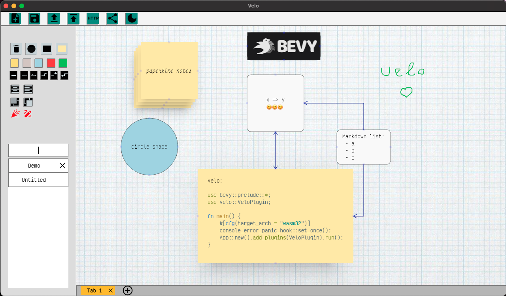

# Velo 🚵‍♀️🚵
[](https://codecov.io/gh/StaffEngineer/velo)




## Demo

This app is primarily designed for native desktop platforms, and its
WebAssembly (wasm) target has a limited feature set. wasm target is best
suited for quick document sharing and editing, currently only landscape
mode is supported (tested on Chrome):  

  [<https://staffengineer.github.io/velo?document=https://gist.githubusercontent.com/StaffEngineer/a2dc4c07c3306005554c1c690a4922ec/raw/d791d27fed7afe0734e4350dfedfc11b65096ee1/velo.json>](https://staffengineer.github.io/velo?document=https://gist.githubusercontent.com/StaffEngineer/a2dc4c07c3306005554c1c690a4922ec/raw/d791d27fed7afe0734e4350dfedfc11b65096ee1/velo.json)

## Inspiration

At work, I frequently rely on lucid.app to brainstorm ideas with my
colleagues or by myself. Typically, I share my ideas by sending either
the diagrams themselves or screenshots of them. While I tend to stick
with simple features like rectangles and arrows, I\'ve been
contemplating the idea of creating a similar tool in Rust. Not only
would it allow me to learn the language, but it would also be an
enjoyable project to work on.

## What\'s implemented:
-   support rectangle/circle/paperlike notes
-   add/remove note
-   note resizing
-   note repositioning
-   wrapped text inside nodes
-   paste screenshot from clipboard [native target only 🖥️] 
-   connect notes with arrows
-   make app snapshot in memory and load from it (MacOs: Command + s\[l\])
-   save app state to database and load from it
-   change background color of notes
-   move note to front/back
-   positioning text inside note
-   multiple documents/tabs support
-   load app state from url
-   ability to create sharable url of the document using \"Share
    Document\" button (**.velo.toml** should be created in user's home
    directory containing GitHub access token with \"gist\" scope) [native target only 🖥️]:

   ```toml
   github_access_token = "<github_access_token>"
   ```

- initial markdown support
  - italic/bold text style
  - links
  - syntax highlighting
  - headings (proper headings support was temporarily removed)
  - inline code
  - ordered/unordered lists
- particles effect [native target only 🖥️]
- filter documents by text in nodes (fuzzy search) [native target only 🖥️]
- highlight nodes containing searched text [native target only 🖥️]
- ligature/emoji rendering support [emoji native target only 🖥️]
- dark/light theme support (app restart is required for now)

## Installation

[Archives of precompiled binaries for *velo* are available for Windows, macOS
and Linux.](https://github.com/StaffEngineer/velo/releases/latest)

### Compiling from Source

If you want to compile from source you can use 
```sh
cargo install --path .
```

**ATTENTION**
If you have set your cargo target directory in `.cargo/config.toml` you must provide the fullpath to the assets directory like this
```sh
BEVY_ASSET_PATH=$(realpath assets) cargo install --path .
```

## Run

Native:

```sh
cargo r --release
```

Wasm:

```sh
cargo install wasm-server-runner
cargo r --release --target wasm32-unknown-unknown
```

To create app bundle with icon (tested only on MacOS):

```sh
cargo install cargo-bundle
cargo bundle
```

## Pre-commit actions

```sh
cargo fmt
cargo clippy -- -A clippy::type_complexity -A clippy::too_many_arguments
```

## Basic usage

- click on rectangle icon to create rectangle note
- double-click to select note
- start typing to add text to selected note
- resize note by dragging its corners
- click on canvas to deselect node
- move note by dragging it (only unselected note can be dragged to allow mouse text selection for selected note)
- click on little arrow connector icon to connect notes, arrow connector icons are placed on each side of note
- for native target there is search box that allows to filter documents by text in notes (fuzzy search)
- for wasm target there is url query parameter `?document=<url>` to load document from url
- click save icon to save document to database on native platform or to localStorage on wasm target

## License
All code in this repository dual-licensed under either:

MIT License or http://opensource.org/licenses/MIT
Apache License, Version 2.0 or http://www.apache.org/licenses/LICENSE-2.0
Unless you explicitly state otherwise, any contribution intentionally submitted for inclusion in the work by you, as defined in the Apache-2.0 license, shall be dual licensed as above, without any additional terms or conditions.

## Contributing
Contributions are always welcome! Please adhere to this project\'s code
of conduct. If you have questions or suggestions feel free to share on [velo discord server](https://discord.gg/u9E4kr4AtU).

❤️
