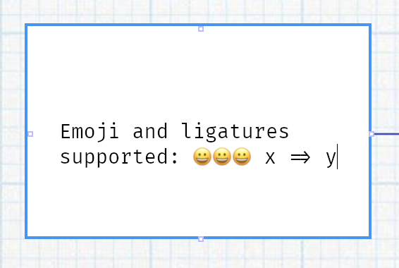

# bevy_cosmic_edit

This bevy plugin provides mutliline text editing for bevy apps, thanks to [cosmic_text](https://github.com/pop-os/cosmic-text) crate!

Emoji, ligatures, and other fancy stuff is supported!



## Usage

⚠️ *Warning: This plugin is currently in early development, and its API is subject to change.*

Explore examples folder for basic usage.

```rust
cargo r --example basic_sprite
```

## Compatibility

| bevy | bevy_cosmic_edit |
| ---- | ---------------- |
| 0.10 | 0.7              |

## License

MIT or Apache-2.0
