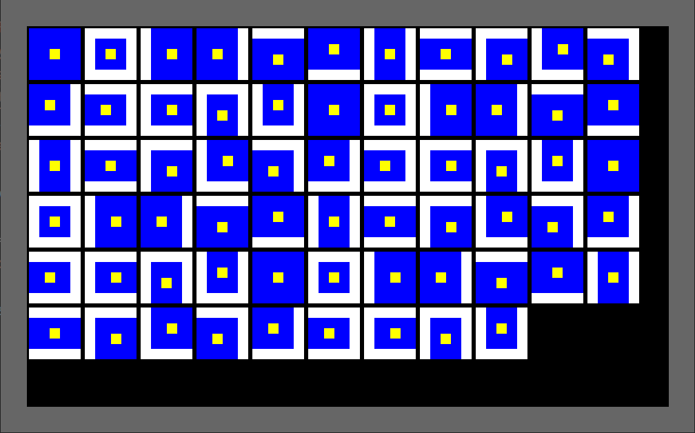

# bevy_ui_borders
[](https://crates.io/crates/bevy_ui_borders)
[](https://github.com/ickshonpe/bevy_ui_borders)
[](https://crates.io/crates/bevy_ui_borders)

## Draw borders around Bevy UI Nodes



* A Bevy plugin that adds border and outline rendering to UI nodes.

* Supports Bevy 0.10

* Only supports solid one-colour borders due to the limitations of the current Bevy UI renderer.


#
## Usage

Add the dependency to your Bevy project:

```
cargo add bevy_ui_borders
```

To display a bordered UI node:
* Add the `BordersPlugin` plugin to your app.
* Spawn an entity with a `BorderColor` component and a `NodeBundle` where the `border` field of its `Style` component is set to a non-zero thickness.

## Components

* `BorderColor`: Defines the color of a UI node's border.
* `Outline`: Specifies the color and thickness of the outline around the UI node's border.

## Bundles
* `BorderedNodeBundle`: A bundle for creating UI nodes with a border and outline.
* `BorderBundle`: A bundle for adding border and outline components to an existing UI node.


## Example

To draw a white UI node with a red border:

```rust
use bevy::prelude::*;
use bevy_ui_borders::*;

fn main() {
    App::new()
        .add_plugins(DefaultPlugins)
        .add_plugin(BordersPlugin)
        .add_startup_system(spawn_example)
        .run();
}

fn spawn_example(mut commands: Commands) {
    commands.spawn(Camera2dBundle::default());
    commands.spawn((
        NodeBundle {
            style: Style {
                size: Size::new(Val::Px(100.), Val::Px(100.)),
                margin: UiRect::all(Val::Px(100.)),
                border: UiRect::all(Val::Px(10.)),
                ..Default::default()
            },
            background_color: Color::WHITE.into(),
            ..Default::default()
        },
        BorderColor(Color::RED),
    ));       
}
```


#
## Examples

```
cargo --run --example minimal
cargo --run --example tiles
cargo --run --example outlines
cargo --run --example stress
```